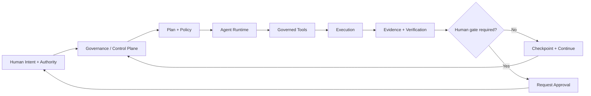

# FORGE OS

> Governed, durable and verifiable AI systems architecture.

FORGE OS is a public engineering showcase by **Aleix Compte** focused on autonomous AI systems, agent runtimes, governance, policy, evidence, approvals, durable state and production-oriented software architecture.

The goal of this repository is to demonstrate **engineering depth, architecture, systems thinking and technical range** without exposing private implementation details, customer data, credentials or production-sensitive code.

---

## What this repository proves

This showcase is designed to make the following capabilities visible:

- designing governed AI agent architectures
- separating control plane and execution plane responsibilities
- modeling identity, authority, policy and approval flows
- designing durable agent runtimes and resumable workflows
- building evidence-first execution and auditability
- designing tool and model registries
- reasoning about failure, rollback and recovery
- building backend and data systems around PostgreSQL and APIs
- working with Python, TypeScript, Node.js, Linux, Docker and GitHub workflows
- integrating LLMs into controlled engineering systems
- designing human-in-the-loop and policy-gated automation
- thinking beyond prompts toward durable autonomous systems

This repository demonstrates **how I engineer systems**, not the private production implementation itself.

---

## Engineering scope

| Area | What is demonstrated publicly |
|---|---|
| AI Agents | lifecycle, routing, delegation, checkpoints |
| AI Governance | authority, policy, approvals, evidence |
| Backend | API boundaries, contracts, stateful services |
| Data | durable state, audit, registries, PostgreSQL patterns |
| Infrastructure | control/execution separation, containers, recovery thinking |
| Automation | governed workflows, gates, tool execution |
| Reliability | verification, rollback, resumability, failure boundaries |
| Security | least privilege, explicit authority, protected internals |
| Engineering Method | discovery → change → test → evidence → verify |
| Model Operations | routing, eligibility, evaluation, provider independence |

---

## Why FORGE

Most AI automation stops at capability:

`prompt → model → tool → result`

FORGE treats capability and authority as different concerns:

`Goal → Agent → Authority → Policy → Execution → Evidence → Audit → Checkpoint`

The system is designed around five questions:

1. **Who is acting?**
2. **What are they allowed to do?**
3. **Which policy authorized the action?**
4. **What evidence proves what happened?**
5. **Can the work resume safely after interruption?**

---

## Core architecture



FORGE separates two major planes.

### Motor — governance / control plane

Owns durable control concerns such as:

- identity and authority
- policy and approvals
- durable knowledge and operational state
- evidence and audit
- registries and checkpoints
- governance APIs and control surfaces

### Cerebro — execution plane

Runs bounded workloads such as:

- agents and delegated work
- builds, tests and evaluations
- tool execution
- model routing
- engineering workloads
- reproducible execution environments

A failure in the execution plane should not destroy governance state.

---

## Durable agent runtime

The target runtime lifecycle is:

```text
Goal
  → Context
  → Plan
  → Policy
  → Route
  → Tool
  → Execute
  → Evidence
  → Verify
  → Evaluate
  → Replan
  → Complete / Gate / Block
  → Checkpoint
```

The architectural objective is resumability without depending on one chat session, one model or one provider.

---

## Engineering method

A core FORGE engineering sequence is:

```text
Discovery
→ Verify
→ Plan
→ Minimal Change
→ Tests
→ Evidence
→ Commit
→ Review
→ Deploy Plan
→ Human Gate when required
→ Apply
→ Verify
→ Checkpoint
```

The distinction between states matters:

`PROPOSED ≠ CODED ≠ TESTED ≠ COMMITTED ≠ DEPLOYED ≠ VERIFIED`

This prevents model output or developer intent from being confused with production evidence.

---

## Example engineering decisions

### 1. Agent identity is durable; models are replaceable

```text
Agent ≠ Model
```

An agent can preserve identity, authority and progress while its underlying model or provider changes.

### 2. Availability is not authorization

```text
Tool available ≠ Tool authorized
```

A tool registry can expose a capability while policy still denies its use for a specific actor or goal.

### 3. Approval is explicit

High-risk actions can transition to a gate rather than continuing automatically.

```text
Execute → Evidence → Verify → Continue
```

or:

```text
Stop → Explain → Request Approval → Wait → Resume
```

### 4. Governance survives execution failure

The execution plane may restart or fail without losing the durable governance state needed to reconstruct what happened and continue safely.

---

## Technology stack

### AI & Agent Engineering
OpenAI APIs · Codex · LLM routing · agent runtimes · tool calling · structured outputs · evaluations · human-in-the-loop systems

### Backend Engineering
Python · TypeScript · Node.js · REST APIs · JSON contracts · service boundaries · asynchronous workflows

### Data & State
PostgreSQL · SQL · durable state · append-only audit concepts · registries · checkpoints · provenance

### Infrastructure & Delivery
Linux · Ubuntu · Docker · containerized workloads · Git · GitHub · CI/CD · SSH · reverse-proxy patterns · VPS infrastructure

### Automation & Integration
n8n · Make · Airtable · webhooks · external APIs · workflow orchestration

### Governance & Assurance
Identity · authority · policy enforcement · approvals · evidence · audit · least privilege · verification · rollback · model/tool eligibility

---

## Architecture and engineering docs

- [Public architecture](docs/ARCHITECTURE.md)
- [Capabilities](docs/CAPABILITIES.md)
- [Technology stack](docs/STACK.md)
- [Engineering principles](docs/PRINCIPLES.md)
- [Public roadmap](docs/ROADMAP.md)
- [Safe public examples](examples/README.md)

---

## What is deliberately not published

This repository does **not** expose:

- production source code
- reusable internal implementation details
- credentials or secrets
- private endpoints
- hostnames or topology identifiers
- customer data
- operational tokens
- deployment credentials
- proprietary policies or security controls
- production database schemas where disclosure would create risk

The objective is **proof of engineering capability without transferring the private implementation**.

---

## Status

**Active engineering project.**

The public repository evolves as a technical portfolio and architectural showcase. The authoritative runtime, production implementation and operational governance remain private.

---

## Author

**Aleix Compte**  
AI Systems Engineering · Agents · Automation · AI Governance

Portfolio: https://aleixcg.com  
LinkedIn: https://www.linkedin.com/in/aleix-compte-9632543a8
