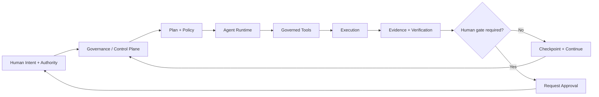

# FORGE OS

> Governed, durable and verifiable AI systems architecture.

FORGE OS is an engineering project focused on a simple problem: **AI systems should be able to act without losing control over why, how, and under whose authority they act.**

It explores an architecture for autonomous engineering systems where agents, models and tools operate inside explicit governance boundaries, generate evidence, preserve durable state and stop for human approval when policy requires it.

This repository is a **public technical showcase**. The production implementation, infrastructure, credentials and private operational details are intentionally not published here.

---

## Why FORGE

Most AI automation stops at capability:

`prompt → model → tool → result`

FORGE treats capability and authority as different concerns:

`Goal → Agent → Authority → Policy → Execution → Evidence → Audit → Checkpoint`

The system is designed around five questions:

1. **Who is acting?**
2. **What are they allowed to do?**
3. **Which policy authorized the action?**
4. **What evidence proves what happened?**
5. **Can the work resume safely after interruption?**

---

## Core architecture



FORGE separates two major planes:

### Motor — governance / control plane
Owns durable control concerns such as:

- identity and authority
- policy and approvals
- durable knowledge and operational state
- evidence and audit
- registries and checkpoints
- governance APIs and control surfaces

### Cerebro — execution plane
Runs bounded workloads such as:

- agents and delegated work
- builds, tests and evaluations
- tool execution
- model routing
- engineering workloads
- reproducible execution environments

A failure in the execution plane should not destroy governance state.

---

## Durable agent runtime

The target agent lifecycle is:

```text
Goal
  → Context
  → Plan
  → Policy
  → Route
  → Tool
  → Execute
  → Evidence
  → Verify
  → Evaluate
  → Replan
  → Complete / Gate / Block
  → Checkpoint
```

The goal is resumability without depending on a single chat session, model or provider.

---

## Engineering principles

- **Capability ≠ Authority**
- Evidence before claims
- Human approval for material or irreversible actions
- Least privilege by default
- Durable state over conversational memory
- Reproducible execution
- Explicit rollback paths
- Provider independence
- Auditable lineage from goal to action
- Models are replaceable resources, not identities
- Tools can be available without being authorized

---

## What FORGE is designed to govern

| Domain | Examples |
|---|---|
| Identity | humans, agents, services |
| Authority | capabilities, roles, delegation |
| Policy | allow, deny, require approval |
| Models | eligibility, evaluation, routing |
| Tools | version, permissions, contracts |
| Evidence | outputs, verification, provenance |
| State | phase, checkpoint, blockers, next action |
| Approval | explicit human decisions |
| Audit | append-only historical trace |
| Engineering | build, test, review, deploy, verify |

---

## Public architecture documents

- [Architecture](docs/ARCHITECTURE.md)
- [Engineering principles](docs/PRINCIPLES.md)
- [Roadmap](docs/ROADMAP.md)
- [Public examples](examples/README.md)

---

## Technology areas

FORGE is being developed around technologies and patterns including:

**AI & agents**  
OpenAI APIs · Codex · LLM routing · agent runtimes · evaluations

**Backend & data**  
Python · TypeScript · Node.js · PostgreSQL · REST APIs · JSON

**Infrastructure**  
Linux · Docker · containerized workloads · GitHub · CI/CD

**Governance**  
Policy enforcement · approvals · identity · authority · evidence · audit · durable state · checkpoints · tool and model registries

---

## Security and disclosure

This repository intentionally excludes:

- production credentials and secrets
- private endpoints
- internal hostnames and infrastructure identifiers
- customer data
- operational tokens
- private source code
- deployment credentials
- sensitive security controls

The public material describes architectural ideas and engineering methodology without exposing production internals.

---

## Status

**Active engineering project.**

This repository documents the public-facing architecture and selected non-sensitive concepts while the private implementation continues to evolve.

---

## Author

**Aleix Compte**  
AI Systems Engineering · Agents · Automation · AI Governance

Portfolio: https://aleixcg.com  
LinkedIn: https://www.linkedin.com/in/aleix-compte-9632543a8
