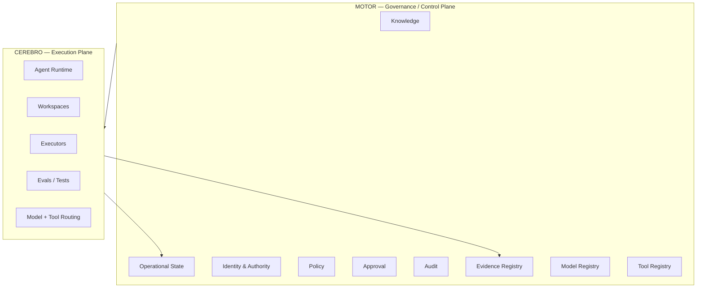
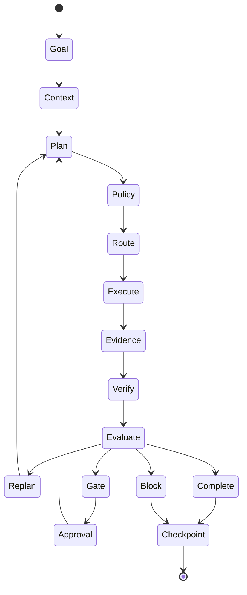

# FORGE OS — Public Architecture

This document describes the public, non-sensitive architecture of FORGE OS.

## 1. Control plane and execution plane

FORGE separates governance from execution.



### Motor
Motor is authoritative for governance state. It should remain lightweight, durable and recoverable.

### Cerebro
Cerebro performs heavier engineering and AI workloads under authority granted by Motor.

The architectural rule is:

> Execution may fail; governance must remain recoverable.

---

## 2. Agent identity is not model identity

An agent is a durable FORGE entity with:

- identity
- authority
- policy
- memory/state
- budget
- tools
- lifecycle

A model is a replaceable computational resource.

```text
Agent ≠ Model
```

This allows the model provider or model version to change without losing the agent's identity, permissions or progress.

---

## 3. Governed execution loop



The important property is that the lifecycle can be checkpointed and resumed.

---

## 4. Human gates

Some actions can execute automatically within delegated authority.

Others require explicit human approval.

Typical gated categories include:

- production deployment
- destructive database operations
- secret or permission changes
- irreversible mutations
- material financial or business risk
- expansion of agent authority

Silence is not approval.

Approval is explicit, scoped and auditable.

---

## 5. Evidence-first operation

FORGE distinguishes:

- observation
- evidence
- inference
- decision
- approval

A model output is not treated as a fact until validated against appropriate evidence.

A target lineage is:

```text
Goal
→ Agent
→ Authority
→ Policy
→ Execution
→ Evidence
→ Verification
→ Decision
→ Audit
→ Checkpoint
```

---

## 6. Registries

FORGE is designed to treat models and tools as governed resources.

### Model Registry
Tracks concepts such as:

- capabilities
- cost
- latency
- evaluations
- risk
- certification
- eligibility

### Tool Registry
Tracks concepts such as:

- version
- permissions
- input/output contracts
- risk
- certification
- audit requirements
- rollback characteristics

Available does not mean authorized.

---

## 7. Independence

The architecture is intended to avoid dependence on any single:

- chat session
- model
- model provider
- interface
- orchestration client

Chat interfaces can act as replaceable clients while durable state, authority and runtime remain part of FORGE itself.
